# BackfillGuard — architecture, in pictures

A visual companion to [`architecture.md`](architecture.md). Every diagram below is checked against the real
files; the names in the boxes are the actual classes you can open.

Read it top to bottom. Each diagram answers **one question** and adds a little detail to the one before it.

> **Rendering.** These are [Mermaid](https://mermaid.js.org) diagrams. GitHub renders them inline. In VS Code /
> Kiro, open the Markdown preview.

---

## Contents

1. [The whole system on one page](#1-the-whole-system-on-one-page)
2. [The one rule that shapes everything](#2-the-one-rule-that-shapes-everything)
3. [The thing this project actually exists to do](#3-the-thing-this-project-actually-exists-to-do)
4. [Ports and adapters](#4-ports-and-adapters)
5. [Where notifications hook in](#5-where-notifications-hook-in)
6. [What a run actually does, step by step](#6-what-a-run-actually-does-step-by-step)
7. [The job's life](#7-the-jobs-life)
8. [The database, and what each table proves](#8-the-database-and-what-each-table-proves)
9. [How the screen stays live](#9-how-the-screen-stays-live)
10. [Who checks the work](#10-who-checks-the-work)
11. [How it runs in a container](#11-how-it-runs-in-a-container)

---

## 1. The whole system on one page

If you only look at one diagram, look at this one.

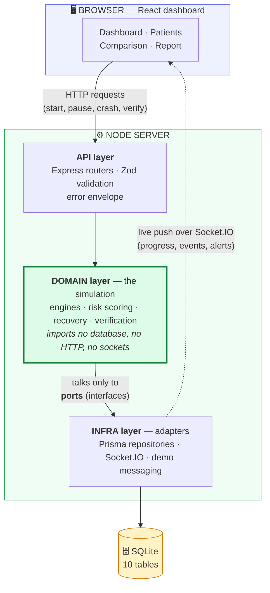

**In words.** You click a button. The API validates the request and hands it to the domain. The domain contains
all the actual logic and is deliberately ignorant of *how* anything is stored or delivered — it only knows a set
of interfaces. Infra supplies the real implementations. Results flow back to the screen by a live push, not by
the browser polling.

**Why the domain box is outlined.** It is the part worth reading. Everything else is plumbing.

---

## 2. The one rule that shapes everything

Arrows point in the direction of *"depends on"*. Notice that **nothing points into the domain**.

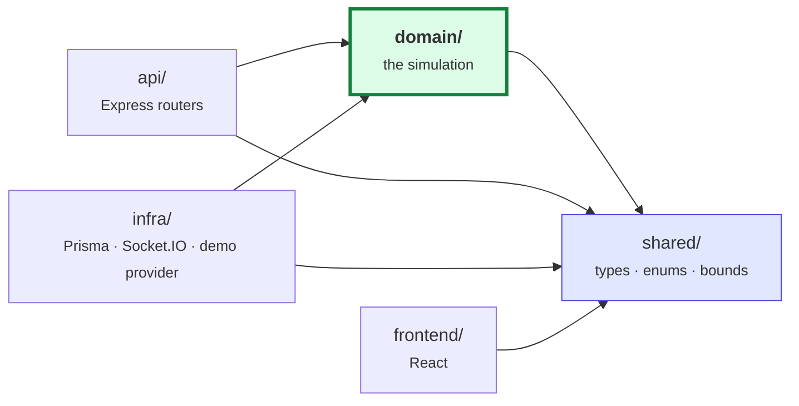

**Why this matters, in plain terms.** The domain cannot import Prisma, Express or Socket.IO. That is not
tidiness for its own sake — it buys three concrete things:

| Because the domain depends on nothing… | you get |
|---|---|
| the same engines run against a real database *or* plain in-memory objects | tests need no database and run in seconds |
| the naive "broken" engine can run beside the safe one, in one process | an honest side-by-side comparison |
| swapping SQLite for Postgres touches only `infra/` | no logic changes, so no new bugs in the logic |

`shared/` sits underneath everyone. It holds the types, the enums and the risk-band boundaries, so the frontend
and backend physically cannot disagree about what `HIGH` means.

---

## 3. The thing this project actually exists to do

Everything above is scaffolding for this one idea.

**The problem.** Scoring a patient takes time. You read the record, compute a score, then write it back. If a
doctor edits that record *in between*, your score describes data that no longer exists — and writing it would
silently destroy the doctor's edit.

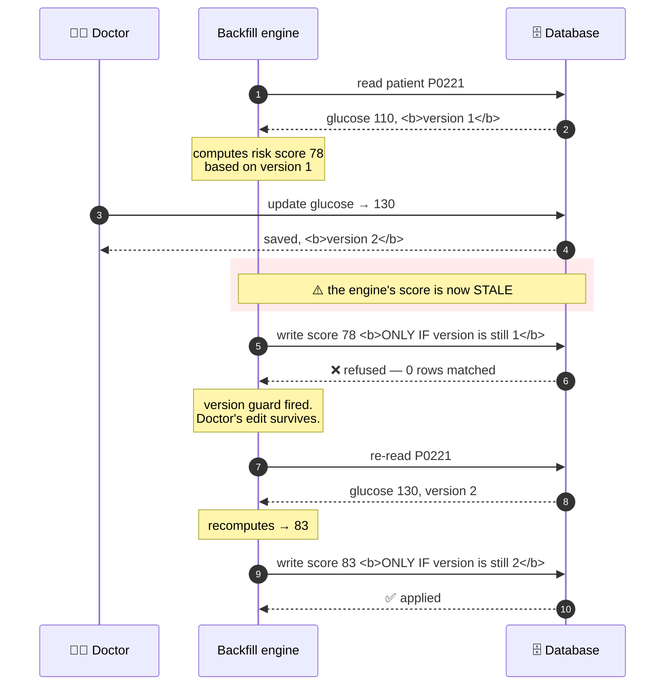

**The whole trick is step 7:** the write carries a condition. `UPDATE … WHERE id = ? AND version = ?`. If
someone moved the record, zero rows match, and the database itself refuses. Safety does not depend on the
engine remembering to check.

### Safe vs naive, side by side

The project ships a deliberately broken engine so the difference is demonstrated, not just claimed.

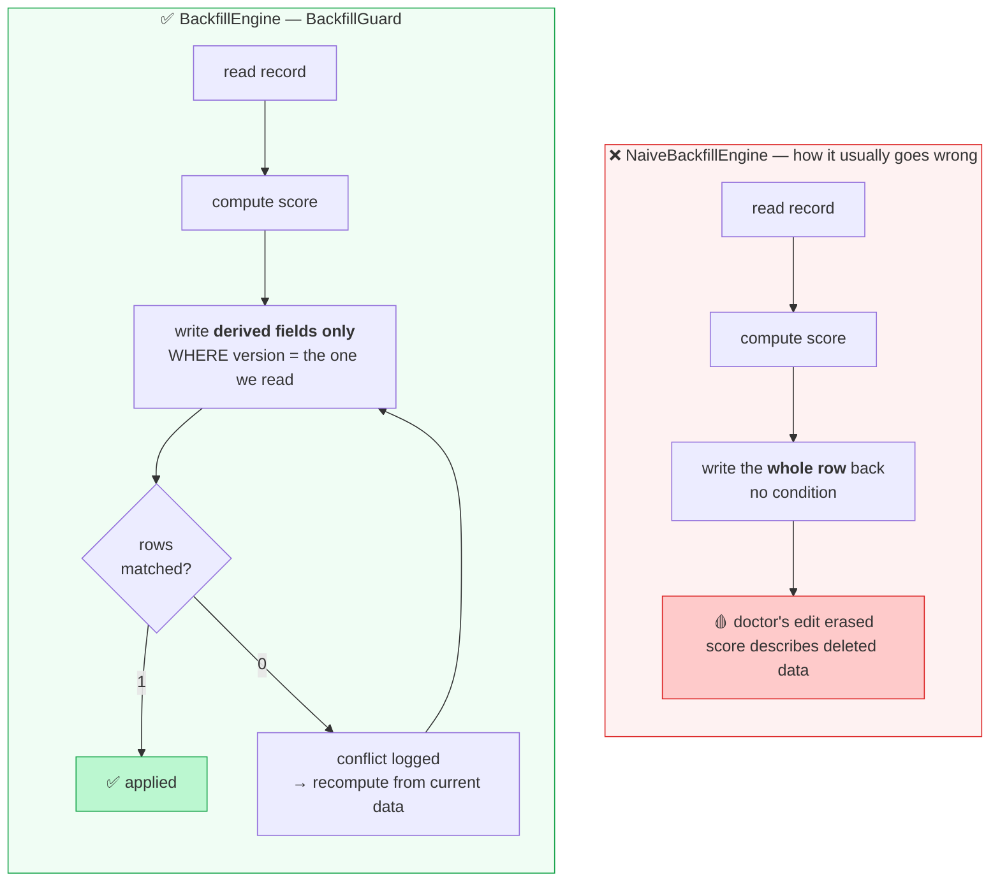

Two differences, both essential:

- **The condition** (`WHERE version = …`) — turns a silent overwrite into a refusal you can react to.
- **Writing only the derived fields** — the naive engine writes the whole row it read, which is what physically
  reverts the clinical value.

---

## 4. Ports and adapters

A **port** is an interface the domain defines: *"I need something that can do this."* An **adapter** is a
concrete implementation. The domain never learns which one it got.

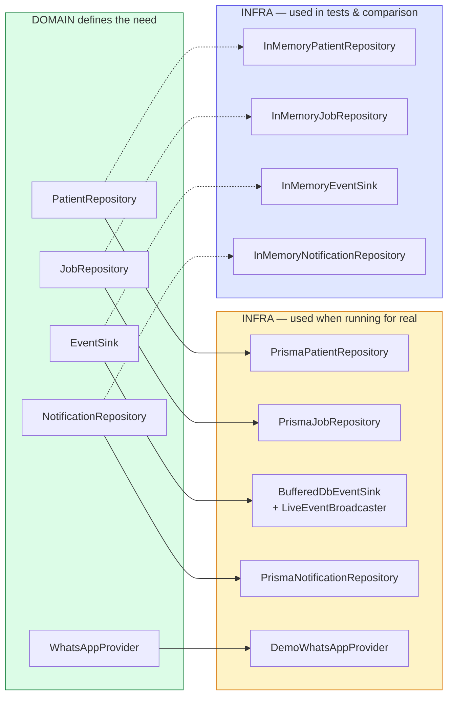

**The catch this design creates, and how it is handled.** Two implementations of one interface can drift apart —
and if the in-memory one is more forgiving than SQLite, every passing test stops meaning anything about the
real system.

So both are run against **one shared contract suite** (`repositoryContract.ts`, `notificationContract.ts`). The
same assertions, both adapters. They cannot disagree without a test failing.

---

## 5. Where notifications hook in

Requirement: send a WhatsApp alert for high-risk patients — but **never** for a score that turned out to be
stale.

The naive approach is to add a "send alert" call inside each engine. There are four places that commit a score,
so that is four chances to forget one, and the easiest to forget is the recovery path, where a stale alert is
hardest to notice.

Instead, note that **every safe commit already goes through one method**: `applyGuarded`. So wrap that.

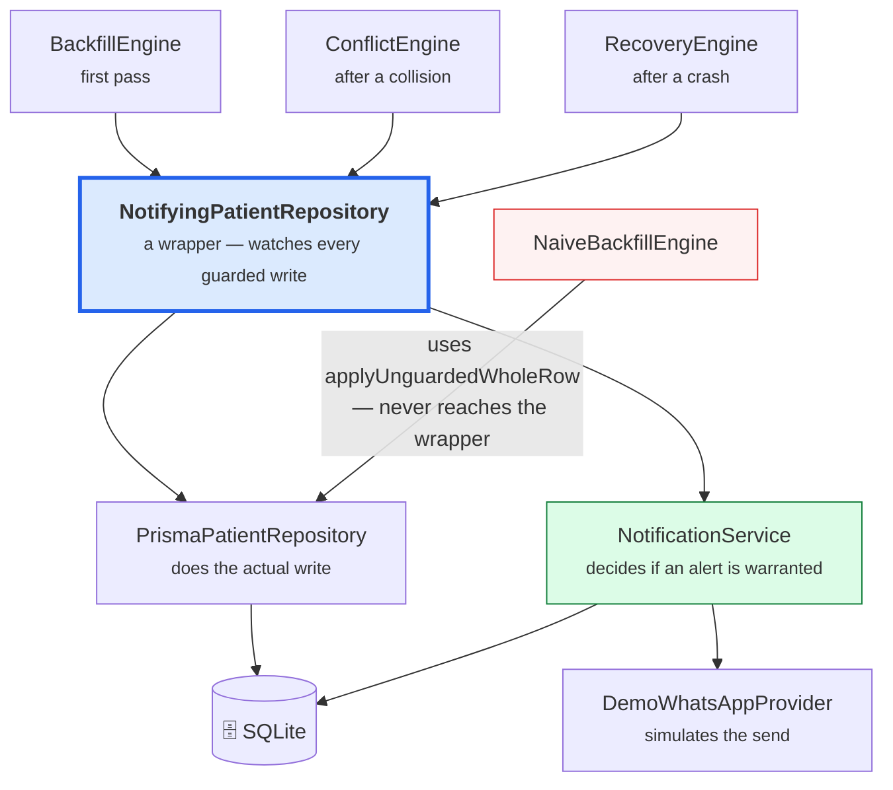

**Four things this buys, for free:**

1. **No engine was modified.** The concurrency logic — the part that must stay correct — carries no alert code.
2. **All three commit paths are covered at once**, including any added later.
3. **The broken engine is excluded automatically**, because it writes through a different method.
4. It is **opt-in**: only the app wires the wrapper, so tests get a plain repository.

### An alert's life

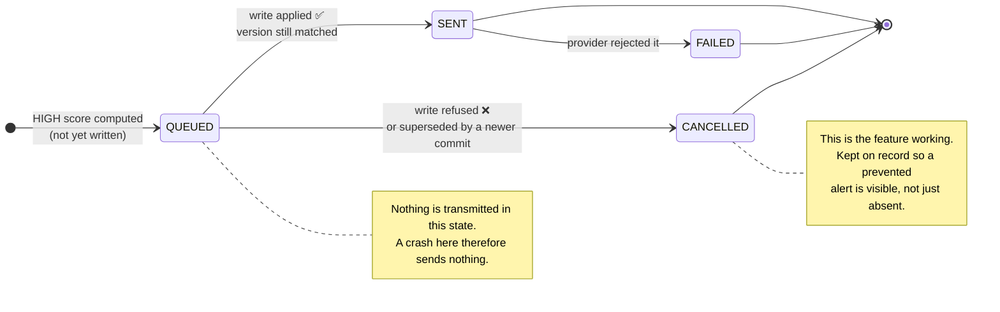

**Why keep cancelled alerts?** Deleting them would be simpler and equally safe — and it would make the safety
mechanism invisible. You would only ever see an *absence* and be asked to trust it. A `CANCELLED` row names the
patient, the stale version, and the version that replaced it. You can point at it.

---

## 6. What a run actually does, step by step

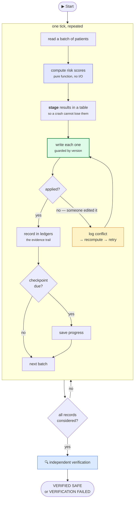

**Why "stage" is a separate step (box 3).** Results live in a database table between being computed and being
written. If they lived only in memory, a crash would lose them — and then the crash-recovery story would be
untestable, because there would be nothing stale left over to *be* refused. Staging is what makes the crash
scenario real.

### Surviving a crash

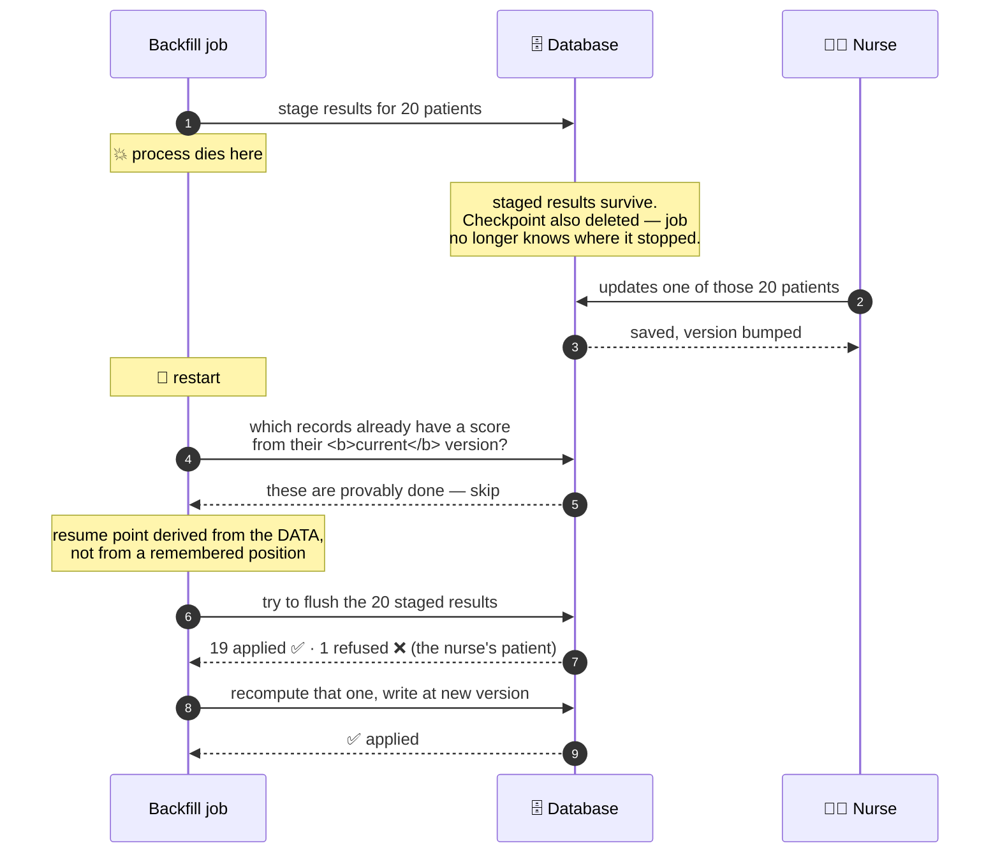

**The point of destroying the checkpoint.** A checkpoint is an optimisation, not a source of truth. Recovery
works out where to resume by *reading the data* — which records already carry a score computed from their
current version. That means correctness does not depend on remembering anything.

---

## 7. The job's life

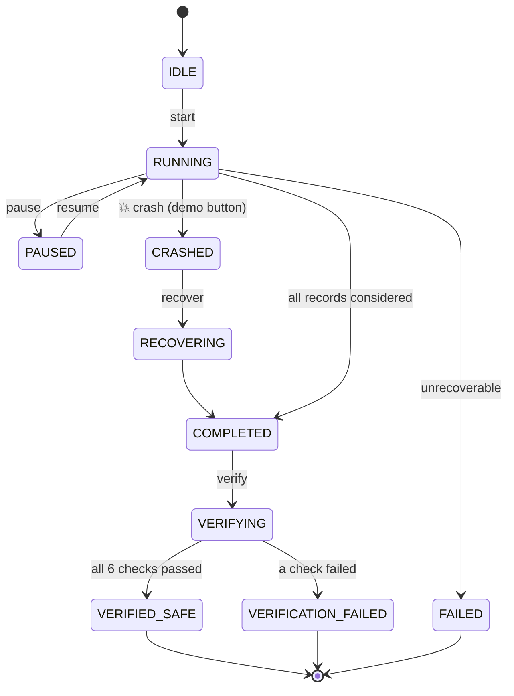

These transitions live in one table in `shared/`, so the backend and the buttons in the UI use the same rules —
the UI cannot offer an action the server would reject.

---

## 8. The database, and what each table proves

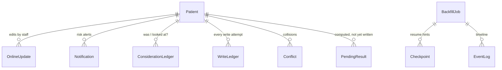

| Table | Its job | What it lets you prove |
|---|---|---|
| **Patient** | the records being backfilled | — |
| **OnlineUpdate** | every clinical edit made by staff | no edit was lost *(the key check)* |
| **PendingResult** | scores computed but not yet written | a crash had something stale to refuse |
| **WriteLedger** | every write **attempt**, applied or refused | no stale write ever landed |
| **ConsiderationLedger** | the final decision per record | every record was looked at |
| **Conflict** | detected collisions + how each was resolved | none was abandoned |
| **Checkpoint** | progress hints | (deliberately destroyed in the demo) |
| **Notification** | risk alerts and their fate | no alert fired on stale data |
| **EventLog** | the human-readable timeline | what happened, in order |
| **BackfillJob** | one migration run | — |

**The idea behind the ledgers.** They are not logs for debugging. They are *evidence*, written so that a
separate program can later re-derive every claim without trusting the engine that made it.

---

## 9. How the screen stays live

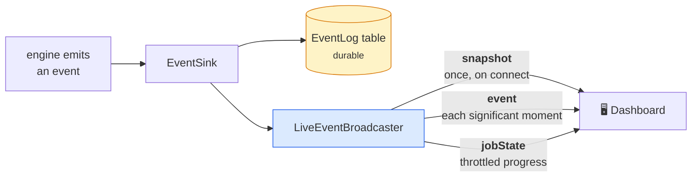

Three channels, on purpose:

- **`snapshot`** — a late-joining viewer gets the current state immediately, instead of an empty screen slowly
  filling in.
- **`event`** — individual moments worth seeing (a conflict, a crash, an alert).
- **`jobState`** — progress, deliberately throttled. A 1,000-record run changes progress thousands of times;
  pushing each one would flood the socket to redraw the same bar.

The browser never polls, and nothing on screen is a local guess — every number came from the server, so two
people watching see the same thing.

---

## 10. Who checks the work

An engine reporting its own success is worth very little. So verification is a **separate** engine that is
handed the repositories and nothing else — no counters, no engine instance.

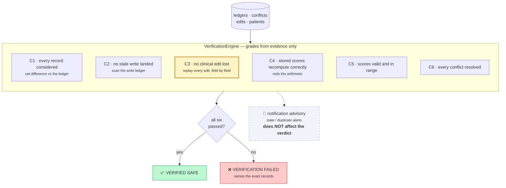

**Why C3 is highlighted.** It is the only check that catches the naive engine. C4 actually *passes* for a naive
run: the engine reverts the clinical value and then scores the reverted value, so the row is internally
consistent — the score and the data agree, and both are wrong. Only replaying the edits reveals it.

**Why the notification advisory is dashed and off to the side.** The verdict is a statement about *patient
data*. If a fault in a demo messaging simulator could turn `VERIFIED SAFE` red, a reader would reasonably
conclude patient data had been corrupted when it had not. It is measured, and reported loudly if wrong — but it
is kept out of the verdict so `VERIFIED SAFE` keeps a precise meaning.

**Falsifiability.** Each check has a test that deliberately breaks the thing it checks and asserts the verdict
flips. "Zero stale overwrites" is only meaningful because a non-zero result is reachable.

---

## 11. How it runs in a container

`docker compose up --build`, then http://localhost:8080.

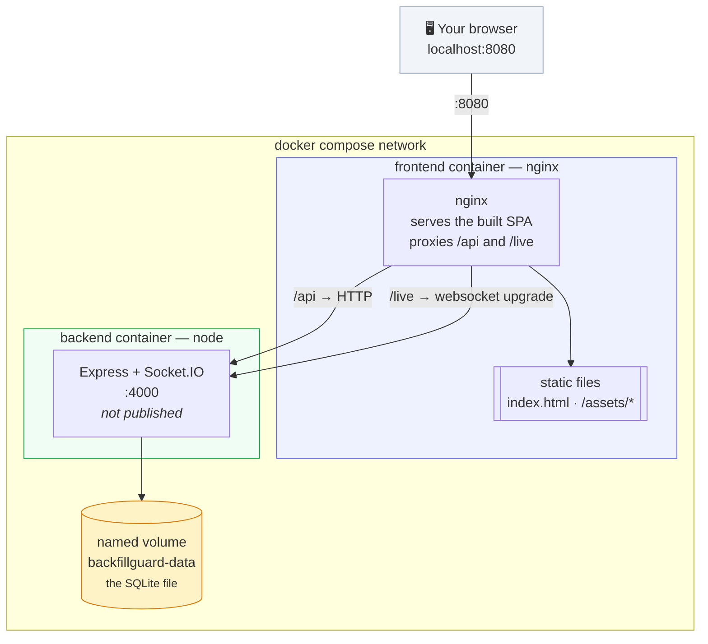

**Only one container is published.** The backend's port 4000 is reachable only from inside the compose network.
Nothing outside needs it, and exposing it would invite the dashboard to be pointed at a different origin than the
one it was built for.

**Why nginx and not Express serving the bundle.** The backend serves no static assets by design; adding that
would mean changing application code to suit the packaging. nginx also reproduces the Vite dev proxy exactly —
same-origin `/api` and `/live` — so the app behaves identically in development and in a container, and no CORS
preflight ever happens.

**The websocket upgrade is explicit.** nginx sets `Upgrade` and `Connection` on `/live`. Without them Socket.IO
silently falls back to HTTP long-polling: the dashboard still works, just less promptly and with far more
requests — the sort of degradation nobody notices until a demo feels sluggish.

### What happens on container start

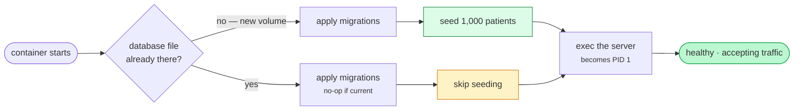

**Seeding only happens on a new volume, and that matters.** Seeding calls `replaceAll`, which is destructive.
Doing it on every boot would silently wipe a completed run every time the container restarted — and the wipe
would look like data loss rather than a seed. Presence of the database file is the signal that this volume has
been initialised before.

**`exec` on the last step is deliberate.** It replaces the entrypoint shell so the server becomes PID 1 and
receives `SIGTERM` directly from `docker stop`. Otherwise the signal stops at the script and the graceful
shutdown — which flushes buffered events to the durable log — never runs.

---

## Putting it together — one request, end to end

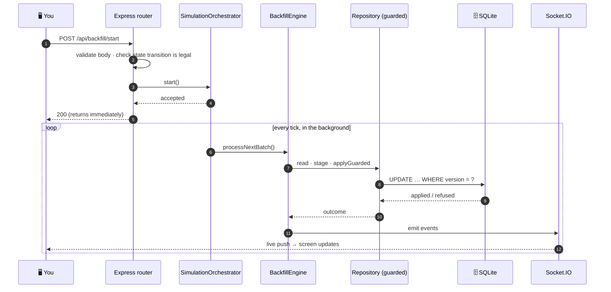

The request returns immediately and the work continues in the background, reporting over the socket. Holding
the HTTP request open for a run that takes ~19 seconds would risk a proxy timeout killing it halfway.

---

## Where to look in the code

| To understand… | Open |
|---|---|
| the safe write itself | `backend/src/infra/repositories/PrismaPatientRepository.ts` → `applyGuarded` |
| the tick loop and job lifecycle | `backend/src/domain/orchestrator/SimulationOrchestrator.ts` |
| conflict handling | `backend/src/domain/engine/ConflictEngine.ts` |
| crash recovery | `backend/src/domain/engine/RecoveryEngine.ts` |
| the audit | `backend/src/domain/verify/VerificationEngine.ts` |
| the deliberately broken engine | `backend/src/domain/engine/NaiveBackfillEngine.ts` |
| notifications | `backend/src/infra/repositories/NotifyingPatientRepository.ts` |
| what the domain is allowed to need | `backend/src/domain/ports/` |

Deeper prose on each decision: [`architecture.md`](architecture.md) ·
[`backfill-algorithm.md`](backfill-algorithm.md) · [`demo-script.md`](demo-script.md)

---

> ⚠️ Every patient record here is randomly generated and the risk score is an invented formula with no clinical
> meaning. The WhatsApp alerts are simulated — no message is ever transmitted.
